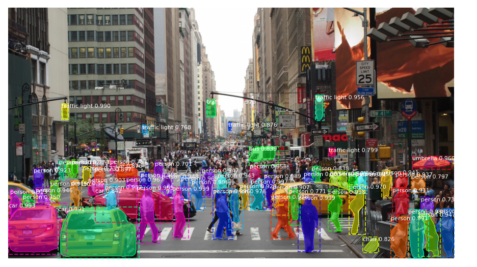

# MaskRCNN_TF2
Mask RCNN implementation code compatible with Tensorflow Version 2.
Made changes to the original version of Matterport Mask_RCNN, which was only compatible with Tensorflow Version 1.

